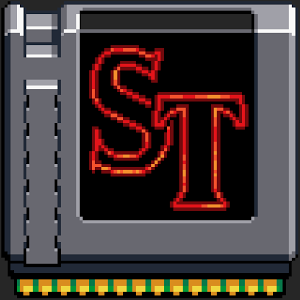

<h1 align="center">Project: Stranger Things</h1>

<p align="center">
  
</p>

This project revolves around crafting a dedicated website for the critically acclaimed series 'Stranger Things' on Netflix. Built with the powerful React.js framework and enhanced with polished styling using SASS and CSS Modules, the website delivers an engaging and informative journey into the mysterious world of Hawkins. The project showcases a modular architecture, refined design, and seamless navigation, providing users with an immersive experience into the supernatural tales and captivating characters of 'Stranger Things'.

<p align="center">
  <a href="#-tecnologias">Technologies</a>&nbsp;&nbsp;&nbsp;|&nbsp;&nbsp;&nbsp;
  <a href="#-projeto">Project</a>&nbsp;&nbsp;&nbsp;|&nbsp;&nbsp;&nbsp;
  <a href="#-layout">Layout</a>&nbsp;&nbsp;&nbsp;|&nbsp;&nbsp;&nbsp;
  <a href="#-license">License</a>
</p>

## 🔗 Links

[](https://instagram.com/davidalmeidadev)
[](https://instagram.com/davidalmeidadev)
[](https://react-project-portfolio.vercel.app/)
[](./LICENSE)

## 🚀 Tecnologies

This project was developed with the following technologies:

- HTML5, CSS3, JS ES6+
- [Node e Yarn](https://nodejs.org/)
- [React.js](https://react.dev/)
- [SASS](https://sass-lang.com/documentation/)
- [CSS Modules](https://github.com/css-modules/css-modules)
- [React-hot-toast](https://react-hot-toast.com/)
- [Typescript](https://www.typescriptlang.org/docs/)
- [Firebase](https://cloud.google.com/firestore/docs?hl=pt-br)

## 💻 Project

This is a single-page website project for programming beginners that has been improved to enhance technologies that have already been studied previously. The Stranger Things website has technologies such as React, SASS, CSS Modules, Google Firebase Firestore and features such as dark mode and integration with the NoSQL database to store data through a form.

In addition, there are also Typescript, Eslint, Prettier, Lint-staged and Husky as great tools to make the code cleaner, more coherent and cohesive for future maintenance that the application may have.

## 🏡 Get started

Installing project dependencies

```sh
yarn install
```

Application initialization

```sh
yarn start
```

Application build

```sh
yarn build
```

## 🔖 Layout

You can view the project layout by clicking [here](https://dribbble.com/shots/8359316-The-Mandalorian?utm_source=pinterest&utm_campaign=pinterest_shot&utm_content=The+Mandalorian&utm_medium=Social_Share).

<p align="center">
  
</p>

## 📝 License

This project is under the [MIT license](./LICENSE).
